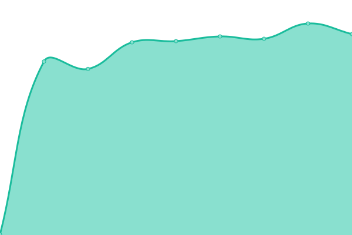

# [📈 Live Status](https://uptime.thonk.xyz): <!--live status--> **🟧 Partial outage**

This repository contains the open-source uptime monitor and status page for [Upptime](https://upptime.js.org), powered by [Upptime](https://github.com/upptime/upptime).

With [Upptime](https://upptime.js.org), you can get your own unlimited and free uptime monitor and status page, powered entirely by a GitHub repository. We use [Issues](https://github.com/upptime/upptime/issues) as incident reports, [Actions](https://github.com/le-server/thonk-upptime/actions) as uptime monitors, and [Pages](https://uptime.thonk.xyz) for the status page.

<!--start: status pages-->
<!-- This summary is generated by Upptime (https://github.com/upptime/upptime) -->
<!-- Do not edit this manually, your changes will be overwritten -->
<!-- prettier-ignore -->
| URL | Status | History | Response Time | Uptime |
| --- | ------ | ------- | ------------- | ------ |
|  [Plex](thonk.xyz:32400) | 🟩 Up | [plex.yml](https://github.com/le-server/thonk-upptime/commits/HEAD/history/plex.yml) | 

 489ms
     
 | 

<a href="https://uptime.thonk.xyz/history/plex">99.81%</a>
    

|  [Sonarr](https://sonarr.thonk.xyz) | 🟩 Up | [sonarr.yml](https://github.com/le-server/thonk-upptime/commits/HEAD/history/sonarr.yml) | 

 952ms
     
 | 

<a href="https://uptime.thonk.xyz/history/sonarr">99.82%</a>
    

|  [Radarr](https://radarr.thonk.xyz) | 🟩 Up | [radarr.yml](https://github.com/le-server/thonk-upptime/commits/HEAD/history/radarr.yml) | 

 944ms
     
 | 

<a href="https://uptime.thonk.xyz/history/radarr">100.00%</a>
    

|  [Transmission](https://transmission.thonk.xyz) | 🟩 Up | [transmission.yml](https://github.com/le-server/thonk-upptime/commits/HEAD/history/transmission.yml) | 

 744ms
     
 | 

<a href="https://uptime.thonk.xyz/history/transmission">99.82%</a>
    

|  [Netdata](https://netdata.thonk.xyz) | 🟩 Up | [netdata.yml](https://github.com/le-server/thonk-upptime/commits/HEAD/history/netdata.yml) | 

 1037ms
     
 | 

<a href="https://uptime.thonk.xyz/history/netdata">100.00%</a>
    

|  [Tautulli](https://tautulli.thonk.xyz) | 🟩 Up | [tautulli.yml](https://github.com/le-server/thonk-upptime/commits/HEAD/history/tautulli.yml) | 

 1221ms
     
 | 

<a href="https://uptime.thonk.xyz/history/tautulli">100.00%</a>
    

|  [Thonk Minecraft](https://api.thonk.xyz/minecraft) | 🟥 Down | [thonk-minecraft.yml](https://github.com/le-server/thonk-upptime/commits/HEAD/history/thonk-minecraft.yml) | 

 2178ms
     
 | 

<a href="https://uptime.thonk.xyz/history/thonk-minecraft">65.86%</a>
    

|  [Thonk Website](https://www.thonk.xyz) | 🟩 Up | [thonk-website.yml](https://github.com/le-server/thonk-upptime/commits/HEAD/history/thonk-website.yml) | 

 728ms
     
 | 

<a href="https://uptime.thonk.xyz/history/thonk-website">100.00%</a>
    

|  [Thonk Status Page](https://status.thonk.xyz) | 🟩 Up | [thonk-status-page.yml](https://github.com/le-server/thonk-upptime/commits/HEAD/history/thonk-status-page.yml) | 

 128ms
     
 | 

<a href="https://uptime.thonk.xyz/history/thonk-status-page">100.00%</a>
    

<!--end: status pages-->

[**Visit our status website →**](https://uptime.thonk.xyz)

## 📄 License

- Powered by: [Upptime](https://github.com/upptime/upptime)
- Code: [MIT](./LICENSE) © [Upptime](https://upptime.js.org)
- Data in the `./history` directory: [Open Database License](https://opendatacommons.org/licenses/odbl/1-0/)
